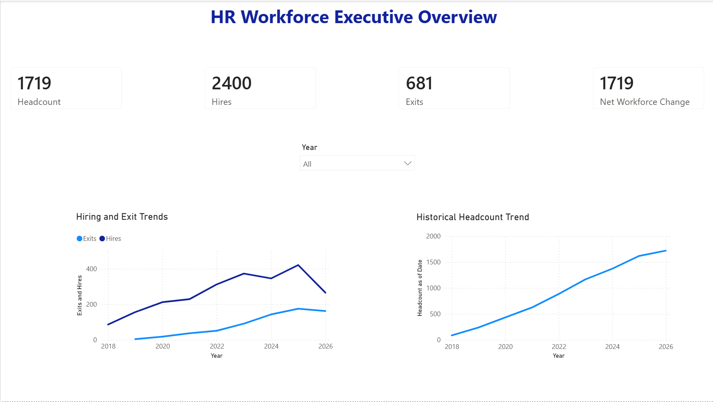
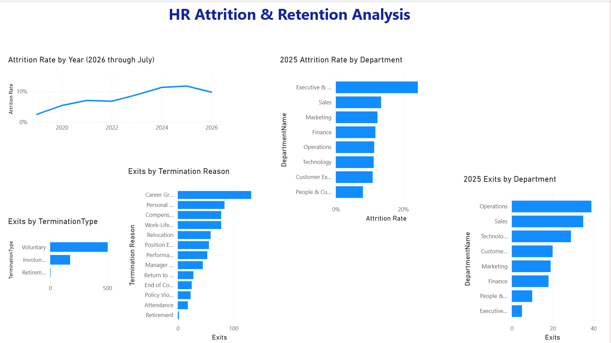
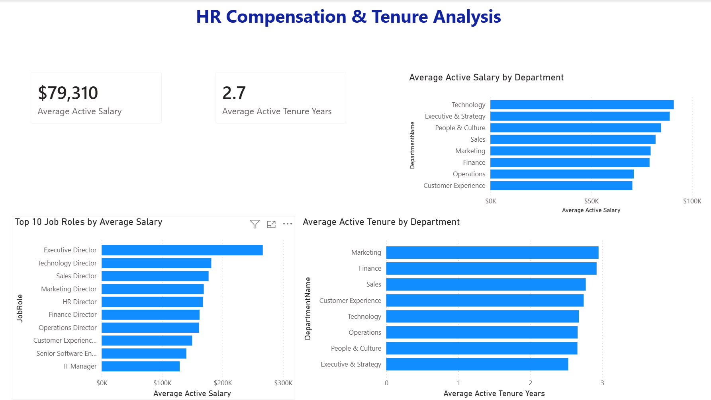
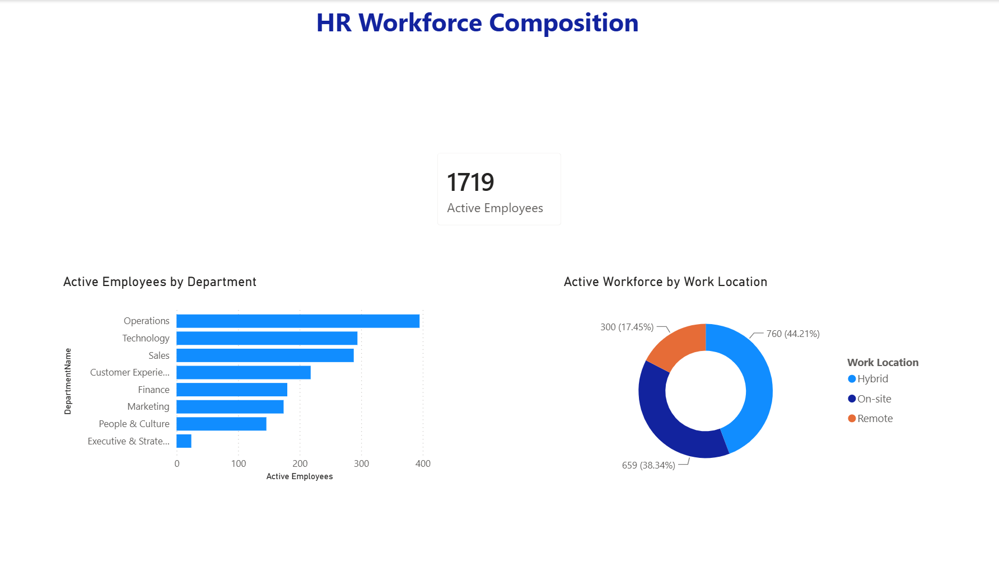

# HR Workforce Analytics Dashboard

## Project Overview

This Power BI project analyzes a synthetic HR workforce dataset containing 2,400 employee records. The dashboard tracks hiring, exits, historical headcount, attrition, compensation, tenure, department size, and work-location distribution. The report is designed to help HR leaders monitor workforce growth, identify retention risks, and understand compensation and workforce composition.

**Data snapshot:** July 31, 2026. Therefore, 2026 results represent year-to-date activity rather than a complete calendar year.

## Tools Used

- Power BI Desktop
- Power Query
- DAX
- Microsoft Excel
- GitHub

## Data Preparation

- Imported and profiled the Employees, Departments, and Job Roles tables.
- Corrected inconsistent capitalization in `RecruitmentSource`.
- Trimmed unnecessary spaces from text fields.
- Preserved valid missing values in performance and engagement fields.
- Verified data types, value ranges, and zero conversion errors.
- Confirmed that every salary band followed `MinSalary <= MidSalary <= MaxSalary`.
- Validated department and job-role identifiers before building relationships.

## Data Model

The model uses one-to-many relationships from the Departments and Job Roles lookup tables to the Employees table. A dedicated Date table supports time-based analysis. The Hire Date relationship is active, while the Termination Date relationship is inactive and activated in exit measures with `USERELATIONSHIP`.

## Key Measures

- Employee Records
- Active Employees
- Terminated Employees
- Hires
- Exits
- Net Workforce Change
- Headcount as of Date
- Beginning Headcount
- Average Headcount
- Attrition Rate
- Average Active Salary
- Average Active Tenure Years

## Dashboard Pages

1. **Executive Overview** — Headcount, hires, exits, net workforce change, hiring and exit trends, and historical headcount.
2. **Attrition & Retention** — Annual attrition trends, departmental attrition, exit volume, termination type, and termination reason.
3. **Compensation & Tenure** — Average active salary, average tenure, departmental comparisons, and the ten highest-paying job roles.
4. **Workforce Composition** — Active employees by department and work-location distribution.

## Dashboard Preview

### Executive Overview

### Attrition & Retention

### Compensation & Tenure

### Workforce Composition

## Key Insights

- The workforce included **1,719 active employees** as of July 31, 2026, from **2,400 total hires** and **681 exits**.
- Voluntary departures accounted for **504 exits (74.0%)**, while career growth was the leading termination reason with **132 exits**.
- The annual attrition rate reached its highest completed-year level in **2025 at 11.7%**.
- In 2025, **Executive & Strategy** had the highest departmental attrition rate at **24.4%**, influenced by its small average workforce, while **Operations** recorded the highest exit volume with **39 exits**.
- The average active salary was **$79,310**. Technology had the highest departmental average at **$90,985**, and Executive Director was the highest-paying job role at **$266,500**.
- Average active tenure was **2.7 years**. Marketing had the highest departmental average tenure at **2.9 years**.
- Operations was the largest department with **395 active employees**.
- Hybrid work was the most common arrangement with **760 employees (44.21%)**.

## Skills Demonstrated

- Data cleaning and validation with Power Query
- Dimensional data modeling and relationship management
- Time-intelligence analysis using active and inactive date relationships
- DAX measure development
- Interactive dashboard design and formatting
- KPI validation and business insight communication

## Files

- `HR_Workforce_Analytics_Dashboard.pbix` — Power BI report
- `Data/HR_Workforce_Analytics_Dataset.xlsx` — Source dataset
- `Images/` — Dashboard screenshots

## Data Note

This project uses a synthetic dataset created for portfolio and educational purposes.
