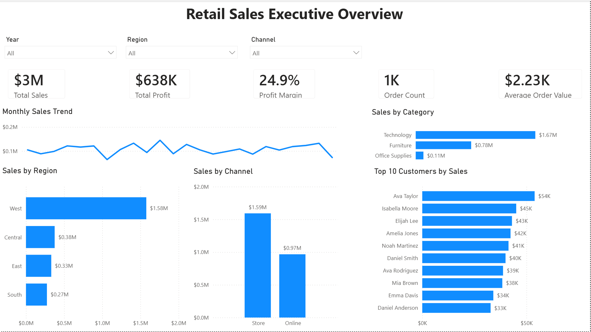

# Retail Sales Analytics Dashboard

## Project Overview

This Power BI project analyzes a fictional retail company's sales performance across products, customers, regions, stores, and sales channels.

The goal was to create an interactive executive dashboard that helps management understand revenue, profitability, customer behavior, and key business trends.

## Business Questions

The analysis was designed to answer questions such as:

* How much revenue and profit is the company generating?
* How are sales changing over time?
* Which product categories and subcategories perform best?
* Which regions generate the most sales and profit?
* How do Store and Online sales compare?
* Which customer segments and customers generate the most revenue?
* How do discounts affect profit margin?

## Tools Used

* Power BI Desktop
* Power Query
* DAX
* Excel
* GitHub

## Data Preparation

The dataset was cleaned and transformed in Power Query before analysis.

Cleaning steps included:

* Standardizing sales channel values
* Replacing blank discount values with 0
* Removing extra spaces from customer city names
* Verifying data types and relationships

## Data Model

A star-schema style data model was created using:

* `SalesTable` — transaction data
* `ProductsTable` — product details
* `CustomersTable` — customer information
* `StoresTable` — store and regional information
* `DateTable` — calendar table for time analysis

The dimension tables have one-to-many relationships with the central `SalesTable`.

## Key DAX Measures

Measures created for the analysis include:

* Total Sales
* Total Cost
* Total Profit
* Profit Margin
* Order Count
* Average Order Value
* Units Sold
* Customer Count
* Average Discount

## Dashboard KPIs

The executive dashboard includes:

* **Total Sales:** $2.56M
* **Total Profit:** approximately $638K
* **Profit Margin:** 24.9%
* **Average Order Value:** approximately $2.23K
* **Order Count:** approximately 1K

## Key Insights

* Sales were nearly identical between 2024 and 2025, with approximately $1.28M generated in each year.
* Technology generated the highest Total Sales and Total Profit.
* Office Supplies had the highest category Profit Margin despite generating the lowest category sales.
* Accessories was the strongest subcategory by Total Sales and Total Profit.
* Shipping had the highest subcategory Profit Margin.
* The West region generated the highest Total Sales and Total Profit.
* The South region had the highest Profit Margin, although the difference compared with West was small.
* Store sales generated more revenue and total profit than Online sales.
* Online sales had a slightly higher Profit Margin than Store sales.
* Consumer was the strongest customer segment by sales, profit, and profit margin.
* Ava Tyler was the top customer by both Total Sales and Total Profit.
* Higher discount levels were associated with substantially lower Profit Margins, with the 20% discount level producing the lowest margin.

## Dashboard Features

The dashboard includes interactive slicers for:

* Year
* Region
* Sales Channel

Visuals automatically update based on user selections and support cross-filtering between charts.

## Project Files

* `Retail_Sales_Analytics_Dashboard.pbix` — Power BI report
* `Retail_Sales_Executive_Overview.png` — dashboard preview
* `Retail_Sales_Analytics_Dashboard.pdf` — exported report
* `Data/Retail_Sales_Project_Data.xlsx` — source dataset

## Project Purpose

This project demonstrates practical skills in data cleaning, data modeling, DAX calculations, business analysis, dashboard design, data validation, and communicating actionable business insights using Power BI.
